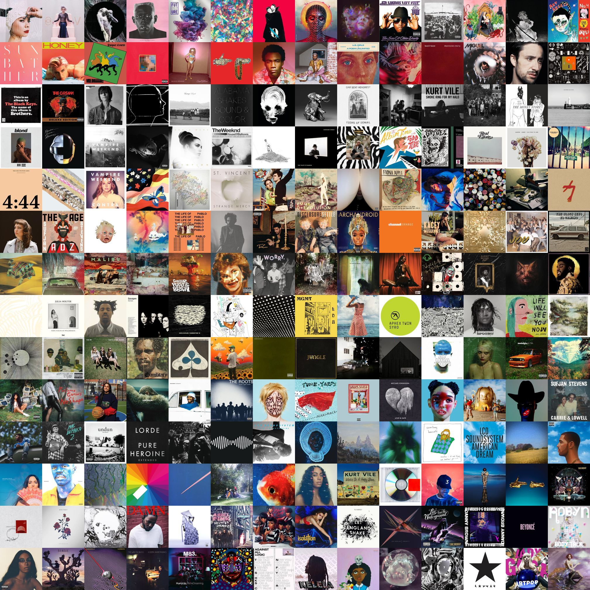
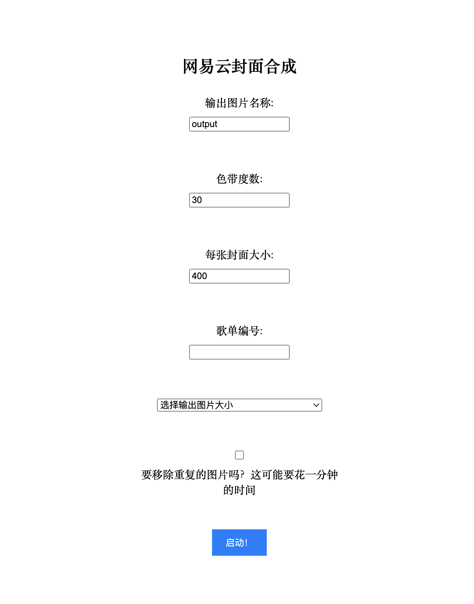

# 网易云歌单封面合成器

## 0904 Version 0.01 Released
成果展示：


### 0. 下载Node Js
如果还没有下载node js，可以去网上搜一下安装node js的教程。这里贴一个菜鸟教程的连接：
```
https://www.runoob.com/nodejs/nodejs-install-setup.html
```

### 1. 如何运行
#### 1.1 在本地git clone [本项目](https://github.com/yangocean-sudo/NetEase-Cloud-Cover-Combiner)
在终端输入
```
$ git clone git@github.com:yangocean-sudo/NetEase-Cloud-Cover-Combiner.git
```
#### 1.2 在本地（推荐相同文件夹下）git clone [网易云API](https://github.com/Binaryify/NeteaseCloudMusicApi)
环境需求：需要 NodeJS 14+ 环境

安装方法：
```
$ git clone git@github.com:Binaryify/NeteaseCloudMusicApi.git
$ cd NeteaseCloudMusicApi
$ npm install
```
或者
```
$ git clone https://github.com/Binaryify/NeteaseCloudMusicApi.git
$ cd NeteaseCloudMusicApi
$ npm install
```
运行方法：
```
$ node app.js
```
这是一个非常好，非常牛的项目，本项目可以说是建立在这个项目的基础上的。
#### 1.3 运行此项目
在主文件夹内：
```
$ cd src
$ npm install
```
返回主文件夹：
```
$cd ..
```
运行:
```
$ make run
```
如果不出意外的话，你会在终端看到：

```
$ cd src && node NetCover.js
$ Server is running on port 3001
```
在浏览器输入网址：```http://localhost:3001/```
就可以看到一个简陋的网页:

### 2. 如何使用
#### 2.1 输出图片名称
顾名思义，就是自定义输出的图片的名字，默认名称为`output`, 会储存在主目录下。
#### 2.2 色带度数
band degree，可以简单理解为调整图片根据颜色排序的值。默认值为30，如果不满意输出的排序的话，可以试着从10调到60.
#### 2.3 每张封面的大小
这里的封面大小指的是下载封面时的分辨率，可以根据歌单里歌曲的数量做调整，如果歌单里有两三百首歌曲的话，调成200就可以有不错的效果。如果五十到一百张的话，可以调成400，歌越多，设置的值就可以相对小一点。

`但请注意`，这并不意味着最后拼贴封面时每张封面的大小就是这个分辨率，程序还会根据输出图片的大小来自动调整每张封面的大小。

举个例子，如果一个歌单里只有四张图片，设置输出图片大小为1024*\1024，但下载封面的大小设置为200，程序就会放大每张封面为512*\512，图片在放大之后会变得模糊。所以再重申一下：`歌单里歌曲的数量与每张封面的大小成反比`，歌曲数量越多，封面大小可以设置的相对较小。
#### 2.4 歌单编号
网易云音乐中每个歌单都有单独的编号，最简单的获取方式是在应用中: `分享`——`复制链接`，复制出来的内容应该长这样：
```
https://music.163.com/playlist?id=2451275926&userid=404361401
```
其中id后面的`2451275926`就是我们所需要的编号，将它复制到输入框中。
#### 2.5 选择输出图片大小
目前有以下选项，应该可以满足大部分用户的需求
<option value="1290 x 2796">1290 x 2796 (适合部分手机)</option>
<option value="2732 x 2048">2732 x 2048 (适合部分平板) </option>
<option value="3072 x 1920">3072 x 1920 (适合部分电脑) </option>
<option value="2048 x 2048">2048 x 2048 (高分辨率正方形)</option>
<option value="1024 x 1024">1024 x 1024 (低一点点分辨率正方形)</option>

#### 2.6 移除重复图片
在这个程序中，属于同一张专辑里的封面只会保留一张，所以基本上不会出现图片重复的问题。

但是，由于网易云糟糕的专辑处理方式，用户可能会接触同一张专辑的不同版本（脏版，净版，豪华脏版，豪华净版），而这些专辑虽然封面图片一样，却不能进行预处理。为了解决此问题，程序可以在拼贴图片的过程中，会对相似的图片进行比较和移除，所以花的时间会久一点。

用户可以先不勾选该功能，看看输出结果如何，如果还是有重复的图片，再勾选该选项。

#### 启动！
以上输入框都输入后，按蓝色启动按钮开启拼贴图片。

### 3 可能遇到的问题
如果遇到网络超时会其他错误，请确认网络已连接且网速正常。然后重新输入
```
make run
```
启动程序

* 测试环境： 
  * macOS 13.1 
  * Intel Core i7
## 0824 Update
### 已完成部分
搭建了一个前端，其中的功能有
  * 自定义输出图片的名字
  * 自定义band degree，也就是一种根据颜色排序图片的方法，具体为根据输入的band degree大小划分色调的色轮，从而确定每一条色带的范围，输出效果可以看文件夹 **Result based on band degree**
  * 自定义每张专辑的大小，如果觉得歌单中专辑封面少，可以设置的大一点，如512；如果觉得专辑封面多（如有300张），则可以设置的小一点，如100。合理的设定大小可以更快速的下载完所有工程并避免不必要的下载错误。


接下来要完成的目标有：
- [ ] 自定义输出图片的尺寸。

- [ ] 根据输出图片的尺寸来调整每张封面的大小，比如，规定输出图片为2048\*2048，则当有100张图时，每张的大小为205\*205，当有4张图的时候，每张图的大小为1024\*1024。
- [ ] 
## 0809 Update
目前已经完成了读取歌单列表，下载歌曲封面，根据颜色排序，组合成一张图片的功能。

接下来想要实现的有：
- [x] 完成前端的搭建，比如说只需要输入歌单的id，剩下的事情都可以交给后端完成，使用户使用体验更加方便和快捷。
- [ ] 根据输出图片的尺寸来调整每张封面的大小，比如，规定输出图片为2048\*2048，则当有100张图时，每张的大小为205\*205，当有4张图的时候，每张图的大小为1024\*1024。
- [ ] 自定义输出图片的尺寸。


